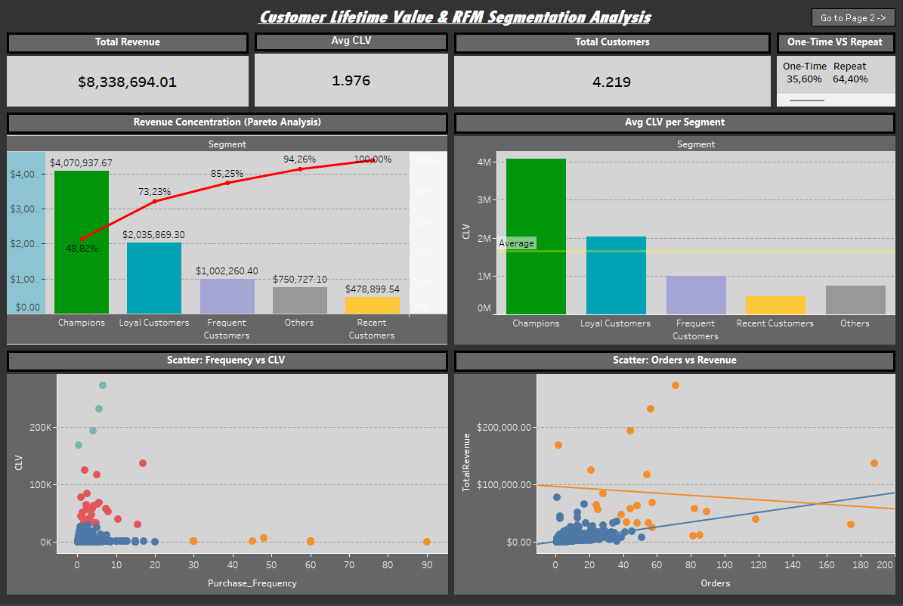
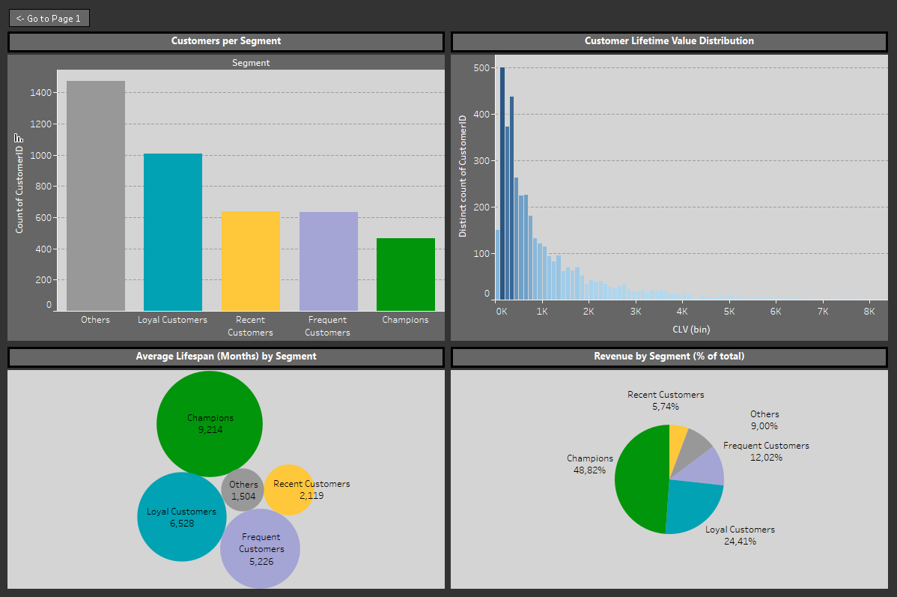
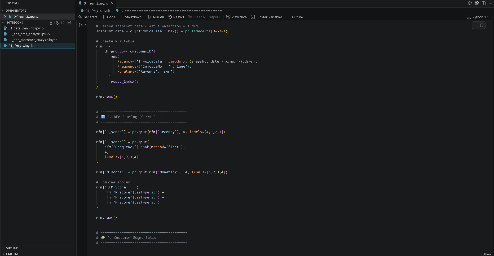

# Customer Lifetime Value & RFM Segmentation Analysis

---

## 📌 Overview

This project analyzes transactional retail data to uncover key drivers of **customer value, revenue distribution, and purchasing behavior**.

The analysis focuses on:
- Customer segmentation using **RFM (Recency, Frequency, Monetary)**
- **Customer Lifetime Value (CLV)** estimation
- Revenue concentration and Pareto behavior
- Customer behavior patterns and seasonality

The objective is to generate **actionable business insights** that support data-driven decisions around retention, customer value, and revenue optimization.

---

## 📂 Project Structure
project/
│
├── data/
│ ├── raw/
│ ├── edited/
│ └── exports/
│
├── notebooks/
│ ├── 01_data_cleaning.ipynb
│ ├── 02_eda.ipynb
│ ├── 03_customer_analysis.ipynb
│ └── 04_rfm_clv.ipynb
│
├── dashboards/
│ └── tableau_dashboard.twbx
│
└── README.md

---

## 🧹 Data Preparation

Key data cleaning steps included:
- Removal of missing `CustomerID`
- Exclusion of cancelled/invalid transactions
- Filtering negative quantities and prices
- Handling missing product descriptions
- Standardizing country values
- Creating the `Revenue` feature

The dataset was then aggregated at a **customer level** to support segmentation and value analysis.

---

## 🧠 Methodology

### 1. RFM Segmentation

Customers were segmented based on:

- **Recency** → How recently a customer made a purchase  
- **Frequency** → Number of unique orders  
- **Monetary** → Total revenue generated  

This resulted in key segments such as:
- Champions
- Loyal Customers
- Frequent / Recent Customers
- Low-value (Others)

---

### 2. Customer Lifetime Value (CLV)

CLV was estimated using:

CLV = Average Order Value × Purchase Frequency × Customer Lifespan

Additionally, a **normalized CLV metric** was introduced to remove bias caused by varying customer lifespans, enabling more meaningful comparisons across customers.

---

### 3. Exploratory Data Analysis (EDA)

Key analyses included:
- Revenue distribution (long-tail behavior)
- Outlier validation (bulk orders & high-value items)
- Customer purchase patterns
- Seasonality trends (monthly revenue & orders)

---

## 🔍 Key Insights

### 👤 Customer Behavior
- ~64% of customers are **repeat buyers**, forming a strong retention base
- Repeat customers generate the **majority of total revenue**
- Customer value distribution is **highly skewed**, with a long tail of low-value users

---

### 💰 Revenue & Value Distribution
- Top 10 customers contribute ~17% of total revenue  
  → Indicates a **balanced revenue distribution** (no extreme dependency)

- Average Order Value is **right-skewed**  
  → Mean significantly higher than median, driven by high-value transactions

---

### 📅 Seasonality & Purchasing Patterns
- Clear seasonality observed with peaks during **pre-Christmas months (Sep–Nov)**

- December shows:
  - Lower order volume
  - Significantly higher Average Order Value (AOV)

- Revenue spikes are primarily driven by **existing customers**, not new acquisition

---

### 🔁 Customer Retention Insights
- Repeat customers:
  - Drive the majority of revenue
  - Show significantly higher AOV during peak periods
  - Dominate top revenue-generating customer groups (9/10 top customers)

- Indicates a **retention-driven business model** with predictable revenue streams

---

### 🧩 RFM Segmentation Insights
- “Champions” represent ~11% of customers but generate a **disproportionately large share of revenue**
- Largest segment consists of low-value customers (“Others”), reflecting a **broad retail base**
- High RFM-score customers are strongly aligned with high revenue contribution

---

### 💎 CLV Insights
- CLV follows a **long-tail distribution**, similar to revenue
- High-value segments (Champions) exhibit significantly higher lifetime value
- Normalized CLV confirms that **top segments drive long-term profitability**

---

## 📈 Business Interpretation

The business demonstrates:
- Strong reliance on **repeat customers**
- Stable revenue driven by **high-value segments**
- Predictable purchasing behavior (especially during peak seasons)

This suggests a **retention-focused growth model**, rather than acquisition-heavy dynamics.

---

## 💡 Business Recommendations

### 1. Prioritize High-Value Customers
- Focus on retention of “Champions”
- Implement loyalty or VIP programs

---

### 2. Strengthen Customer Retention
- Develop strategies to convert one-time buyers into repeat customers
- Optimize post-purchase engagement

---

### 3. Target At-Risk Customers
- Identify high-value customers with declining activity
- Use personalized reactivation campaigns

---

### 4. Optimize Marketing Strategy
- Allocate budget toward high-CLV segments
- Reduce overspending on low-value acquisition

---

## 📊 Dashboard (Tableau)

The analysis is complemented by an interactive Tableau dashboard featuring:
- KPI overview
- Customer segmentation breakdown
- Revenue distribution & Pareto analysis
- CLV insights

---

## 📊 Dashboard Preview

### 🔹 Overview

### 🔹 Code Overview

## 🛠️ Tools Used

- **Python (Pandas)** → data cleaning, transformation, analysis  
- **Tableau** → data visualization & dashboarding  
- **Excel** → intermediate exports & validation  

---

## 📌 Conclusion

This project demonstrates how customer-level analysis can uncover key revenue drivers and support strategic decision-making.

The results highlight the importance of:
- Customer segmentation
- Lifetime value analysis
- Retention-focused strategies

Focusing on high-value and repeat customers can significantly improve long-term business performance.